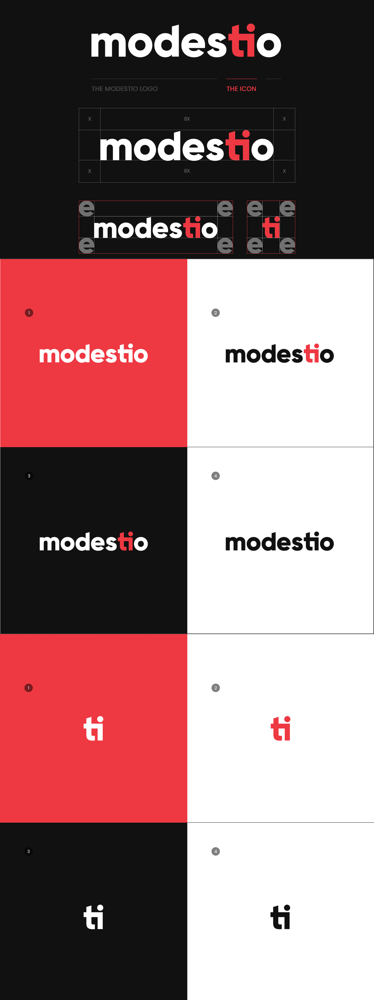

# Project studio MODESTIO

## Case study
The main goal of this project was to create a young studio that could succeed in the future. In the beginning, it was just school graduate fun. After a few months, however, we decided to start the studio and start working. In building a studio, we want to prove that by friendly actions we can reach a high level.

### What is modestio?
Modestio is a small creative studio founded by two friends who wanted to fulfill their dream and set to work. Design, advertising, creative
thinking, and a friendly atmosphere. All this connects the studio to
a unique perfect whole.

### Characteristic
The work in our studio holds a lot of important points
to achieve perfect cooperation and maximum
customer satisfaction. Thanks to these points, the studio can do it
move in the modern world without a single problem and
is familiar with most graphic categories.

### Friendly
Friendly operation is our main characteristic. At the first meeting with the client, we try to impress them with kindness. During the cooperation, we strive for maximum satisfaction
and trust from the client directed directly to us.

### Teamwork
Because we do not work in the studio as freelancers but as a team
gives the work a completely different view of two people who are of their designs will create an original product. That's why we try from
initial proposals to offer the client the opportunity to choose
a path that will interest him.

### Work showcase

