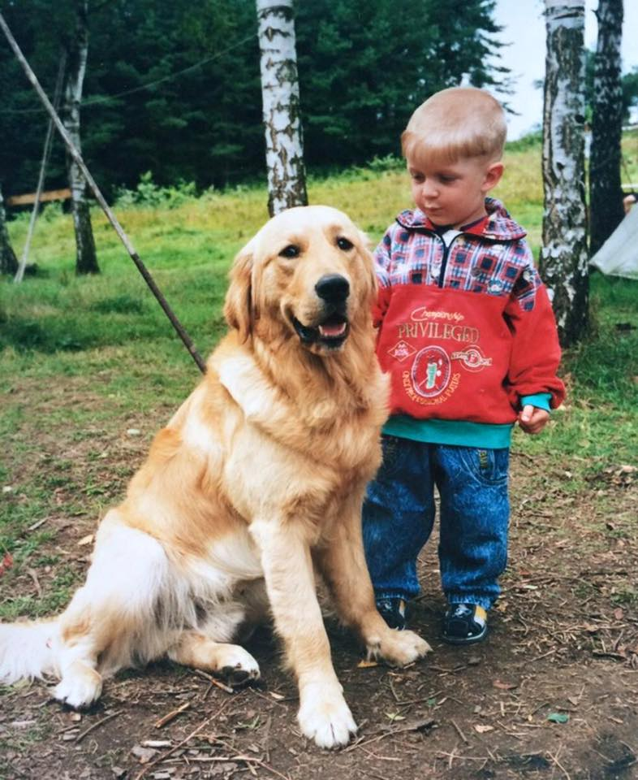

# Samuel Preisler

## About Me

Hi my name is Samuel Preisler, a graphics designer working mostly on branding projects, websites, and advertising strategies as a frontend.

## My story

I was born in the north of the Czech Republic close to Germany where I lived with my parents in a small town called Česká Kamenice.

I have loved music and art since I was little. I studied guitar, violin, drums and sometimes sang in a student band. Later I got into art that got me to Prague at the age of fifteen, where I started a high school of art.

In Prague, I learned a lot of things, gained contacts and started working as a freelance graphic designer. This year me and my friend created a small studio where we work hard every day to achieve our dreams.

- [View Selected Case Study](case-study.md) 
