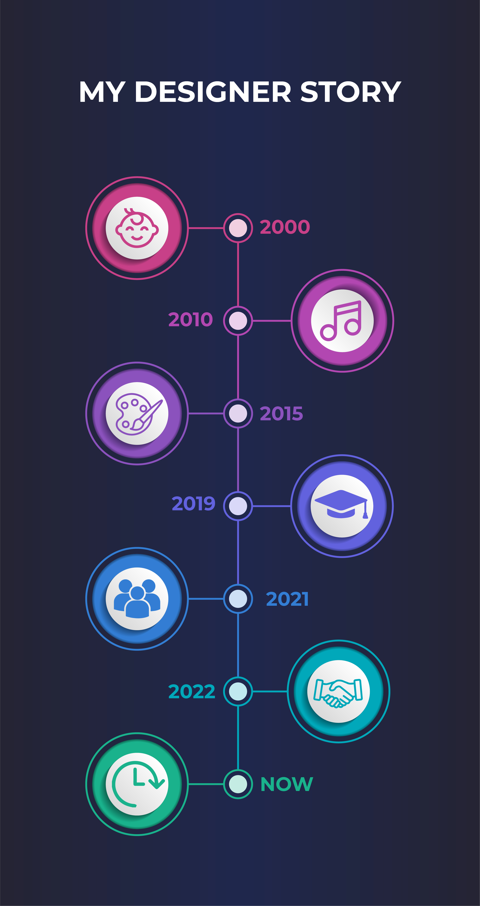

## 2000
How to start my little artist story. The year 2000 is written exactly on the day of 14.4. I was born in a small hospital in the town of Děčín. Since then, I started living with my parents in a small town called Česká Kamenice. It was a beautiful experience of my childhood in a small town where there was such a nice silence.

## 2010
My parents have led me to various artistic categories since I was a child. I started playing the violin at the age of four, then I added guitar, bass and drums. Thanks to that, I started a band called Ankara. We had a couple of city concerts and it was just beautiful. Shortly afterward, I became interested in art. I went to drawing, painting and ceramics. It occurred to me at this very moment. I will be a graphic designer!

## 2015
After graduating from elementary school, I went to Prague to study at the high school of art and advertising. It was very difficult to get used to the big city, but after a few months, I managed it. I got a lot of necessary information about design and advertising. I also met my best friend who taught me much more than school gave me. His name is Martin and he is a co-founder of our studio.

## 2019
This year I successfully completed high school and showed my first big project on Peace Square in Prague. The project dealt with nature conservation and I was very happy to have it there on the billboard. But this year was especially important in that I launched the Modestio project together with my colleague Martin. This project dealt with the launch of a graphic studio. The last thing that happened was that I joined VOS Michael with a focus on graphic design.

## 2021
This period was important for both education and experience. After graduating from Michael VOS, I joined VŠKK, which in my opinion will be the last stage of my education. The most important things that happened were about my studio. We finally got the first clients for the studio and the big game could start. We put everything into it and sometimes we stopped sleeping.

## 2022
The studying is slowly coming to an end and for the studio it means that I will be able to work 200% more for it. We have completed the largest client of our career for the forests of the Czech Republic, and thanks to that, a lot of doors have opened for us. We recently gained two more big clients and we can finally start a new life. I've never believed much in my life, but it changed. Modestio works and life goes on.

## NOW
What would I say about the present? I simply know that I have learned a lot over the years. I met a lot of great friends, professors and other people who helped me achieve unreal things in my life. Thank you to all those people! So I hope you liked my story and we move on :)
