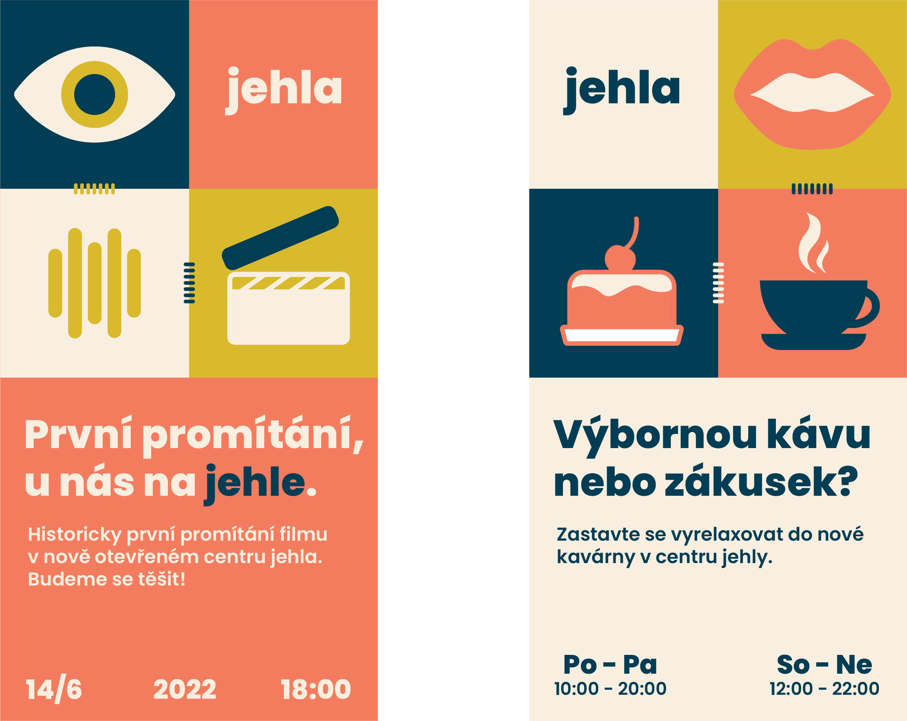
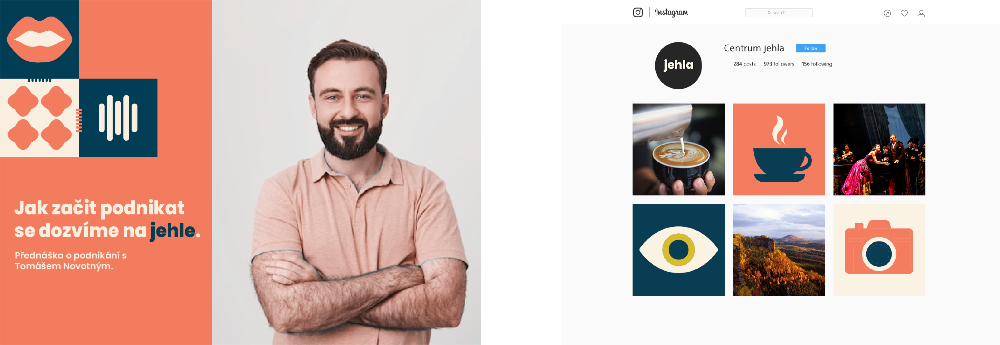

# PROJECT STITCHED WITH A NEEDLE

This bachelor thesis deals with the creation of a communication strategy and visual for the newly prepared cultural building in Česká Kamenice. The thesis contains the concept of a strategy that seeks to connect cultural institutions of the same type between cities. In the practical part we will find the creation of a visual style from the name, the creation of the logo to the overall style that will be needed, for example, for promotion on social networks.

## A PIECE OF HISTORY

The Česká Kamenice cinema was built in 1912 by Berta and Josef Seiche in just four months.
The Seiches saw film performances not only as a cultural issue, but also as a means to increase
tourism in the city.

City Council
decided to rebuild the old cinema according to new trends, increase the pitch of the auditorium. The action started at the end
November 1987 and lasted until December 1992

## DESIGN CONCEPT

Creating a visual style was not easy at all. I'm a graphic designer who mostly works with large corporations. Simply put, work where you are dealing with a client with a tie, you are sitting at one table and he will describe his design instructions with his poker face.

But this work was completely different. I had to express emotions, freedom and joy. I started by thinking about the colors of the culture. Then I combined simplicity in the pictograms and built a marketing strategy on it.

Overall, thanks to this work, I was able to taste the freedom in design. So let's look at a few examples I've created.

Few slogans

Easy pictogram posters

And a little bit of social media.

